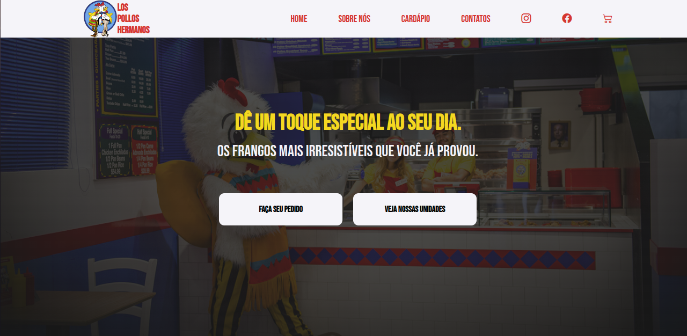

    
    <h1 align="center">Los Pollos Hermanos Landing Page</h1>

  
  

Esta landing page é um projeto inspirado no restaurante *Los Pollos Hermanos* do universo *Breaking Bad*. O objetivo é criar uma página inicial interativa e visualmente atraente para o restaurante fictício.

# :pushpin: Objetivo

Este projeto está sendo desenvolvido para treinar e aprimorar conceitos relacionados a front-end, incluindo design responsivo, criação de layouts e interação com o usuário.

# ✔️ Status de Desenvolvimento

# ⚡ Demonstração

Uma demonstração da página web:

